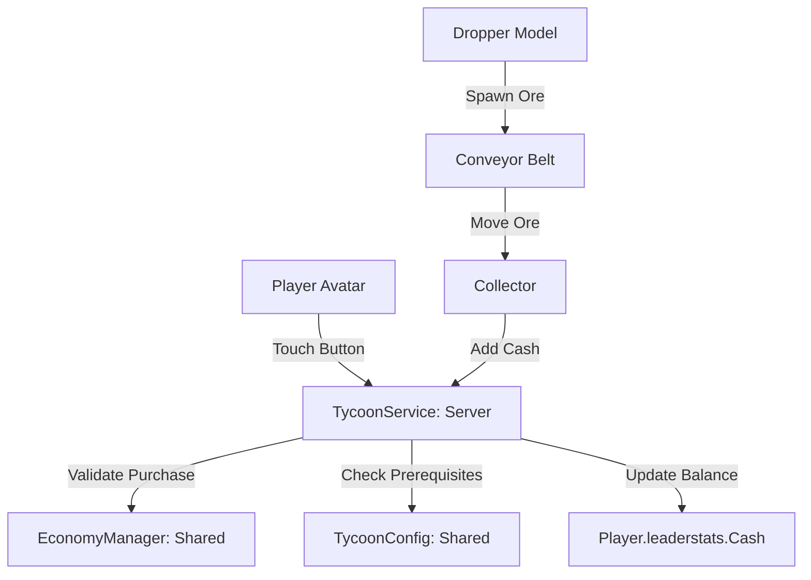

# Архитектура проекта roblox (Tycoon)

## Принципы организации кода
Проект использует классическое клиент-серверное разделение Roblox с синхронизацией через Rojo.

### Сервисы и модули
1. **ReplicatedStorage (Shared)**:
   - `MathUtils.luau`: Чистые математические вычисления (`clamp`, `lerp`, расчет опыта/уровней).
   - `TycoonConfig.luau`: Дерево предметов, стоимость, типы (Dropper, Structure, Collector), зависимости и интервалы выпадения.
   - `EconomyManager.luau`: Логика валидации покупок, проверка достаточного количества средств, расчет множителей.

2. **ServerScriptService (Server)**:
   - `init.server.luau`: Главная точка входа на сервере, подключение событий `PlayerAdded` и `PlayerRemoving`.
   - `TycoonService.luau`: Серверное хранилище состояния игроков, создание `leaderstats` с валютой `Cash`, валидация и проведение транзакций покупок, начисление дохода.

3. **StarterPlayer.StarterPlayerScripts (Client)**:
   - `init.client.luau`: Клиентский скрипт инициализации пользовательского интерфейса, локальных эффектов и взаимодействия.

## Потоки данных тайкуна

## Безопасность
- Все денежные транзакции и проверки предметов выполняются строго на сервере в `TycoonService`.
- Клиент не имеет прямого доступа к модификации значений баланса.
