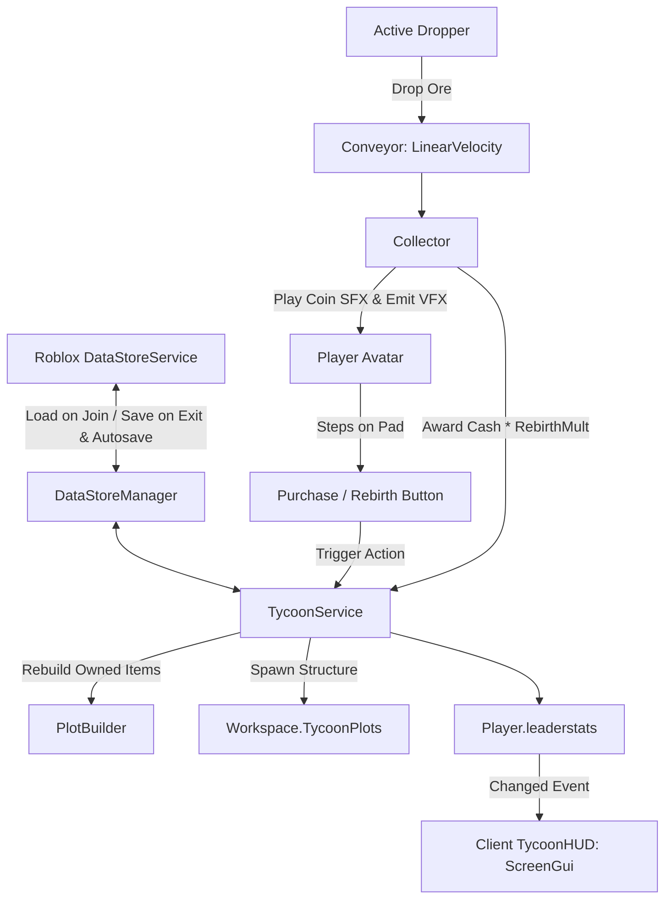

# Архитектура проекта roblox (Tycoon)

## Принципы организации кода
Проект использует строгую клиент-серверную архитектуру Roblox, синхронизацию через Rojo, сохранение в облачном DataStore и динамическую 3D-генерацию мира.

### Сервисы и модули
1. **ReplicatedStorage (Shared)**:
   - `MathUtils.luau`: Математические утилиты (`clamp`, `lerp`).
   - `TycoonConfig.luau`: Конфигурация предметов, параметров, зависимостей, цен и интервалов дропа.
   - `EconomyManager.luau`: Валидация покупок, проверка достаточного баланса, расчет множителей.

2. **ServerScriptService (Server)**:
   - `init.server.luau`: Серверная точка входа, подключение событий игроков, таймер автосохранения (каждые 60 с), перехват `game:BindToClose`.
   - `DataStoreManager.luau`: Инкапсуляция `DataStoreService:GetDataStore("TycoonSave_v1")`, безопасные вызовы через `pcall`, повторные попытки (retries), валидация и дефолтные профили.
   - `PlotBuilder.luau`: Процедурный генератор 3D-базы: восстанавливает сохраненные постройки при входе, проигрывает звуки сбора монет (`Sound`) и частицы (`ParticleEmitter`), создает кнопку Rebirth.
   - `TycoonService.luau`: Управление профилями игроков, начисление дохода с множителем Rebirth (`1 + rebirths * 0.5`), списание баланса, логика сброса при перерождении.

3. **StarterPlayer.StarterPlayerScripts (Client)**:
   - `init.client.luau`: TycoonHUD — современный темный интерфейс в левом верхнем углу с балансом, множителем и счетчиком перерождений с микроанимациями через `TweenService`.

## Потоки данных

