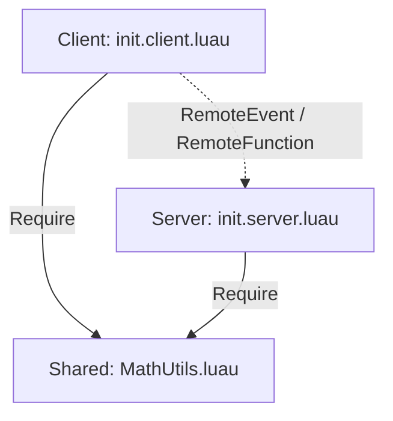

# Архитектура проекта roblox

## Принципы организации кода
Проект использует классическое клиент-серверное разделение Roblox с синхронизацией через Rojo.

### Сервисы Roblox DataModel
1. **ReplicatedStorage (Shared)**:
   - Маппится из директории `src/shared`.
   - Содержит модули (`ModuleScript`), доступные как серверу, так и клиенту.
   - Используется для чистых утилит, математических расчетов, констант конфигурации, сетевых протоколов.
   - Пример: `MathUtils.luau`.

2. **ServerScriptService (Server)**:
   - Маппится из директории `src/server`.
   - Содержит серверные скрипты (`Script`), выполняемые исключительно на стороне сервера.
   - Управляет состоянием игроков, персистентностью данных, валидацией действий и защитой от читеров.
   - Точка входа: `init.server.luau`.

3. **StarterPlayer.StarterPlayerScripts (Client)**:
   - Маппится из директории `src/client`.
   - Содержит клиентские скрипты (`LocalScript`), исполняемые на устройстве игрока.
   - Отвечает за рендеринг UI, обработку ввода (клавиатура, мышь, геймпад, тачскрин), камеру и локальные визуальные эффекты.
   - Точка входа: `init.client.luau`.

## Потоки данных (Data Flow)

## Безопасность
- Клиент никогда не должен считаться доверенным источником истины.
- Все критичные операции (выдача валюты, повышение уровня, расчет урона) валидируются и производятся на сервере.
