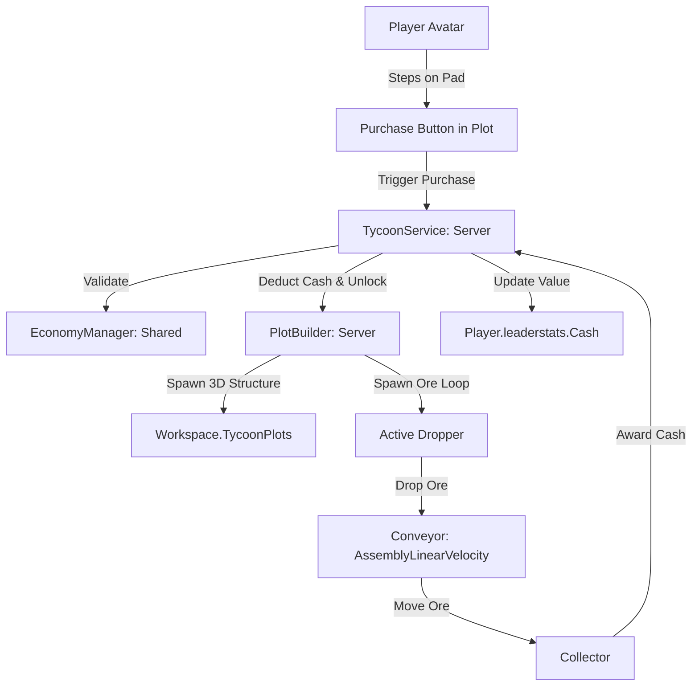

# Архитектура проекта roblox (Tycoon)

## Принципы организации кода
Проект использует клиент-серверное разделение Roblox с синхронизацией через Rojo и процедурной генерацией 3D-мира базы.

### Сервисы и модули
1. **ReplicatedStorage (Shared)**:
   - `MathUtils.luau`: Чистые математические вычисления (`clamp`, `lerp`, расчет уровней).
   - `TycoonConfig.luau`: Конфигурация предметов тайкуна, стоимости, категорий, зависимостей, интервалов дропа и скоростей конвейера.
   - `EconomyManager.luau`: Валидация покупок, проверка достаточного баланса, расчет множителей.

2. **ServerScriptService (Server)**:
   - `init.server.luau`: Серверная точка входа. Назначает базы входящим игрокам и запускает их жизненный цикл.
   - `PlotBuilder.luau`: Процедурный 3D-генератор базы. Создает платформу, вывеску с ником игрока, конвейерную ленту с физической скоростью, неоновый сборщик монет и динамические интерактивные кнопки покупок. Запускает цикл спавна физической руды из дропперов.
   - `TycoonService.luau`: Серверная служба игровых профилей, валюты `Cash` в `leaderstats`, безопасного списания и начисления дохода.

3. **StarterPlayer.StarterPlayerScripts (Client)**:
   - `init.client.luau`: Клиентский скрипт инициализации.

## Потоки данных тайкуна

